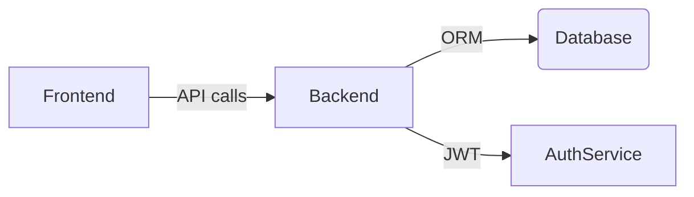

# Easy Traceability System

---

&#x20;&#x20;

A full-stack, modular solution for warehouse inventory management and product traceability. Designed with best practices in mind to enable developers of all levels to quickly understand, extend, and deploy.

---

## Table of Contents

1. [Features](#features)
2. [Tech Stack & Architecture](#tech-stack--architecture)
3. [Prerequisites](#prerequisites)
4. [Installation & Setup](#installation--setup)
5. [Configuration & Environment Variables](#configuration--environment-variables)
6. [Development Workflow](#development-workflow)
7. [Usage](#usage)
8. [Running with Docker](#running-with-docker)
9. [Testing & Linting](#testing--linting)
10. [API Reference](#api-reference)
11. [Troubleshooting](#troubleshooting)
12. [Contributing](#contributing)
13. [Issue & Pull Request Templates](#issue--pull-request-templates)
14. [Future Enhancements](#future-enhancements)
15. [License](#license)
16. [Contact](#contact)

---

## Features

* **Barcode Generation**: Code128 barcodes for labelling.
* **Data Collection**: Simulated scanning & manual entry.
* **Inventory Management**: Stock levels, thresholds, alerts.
* **Secure API**: JWT authentication + TLS.
* **Realtime Reporting**: React dashboard with DevExtreme charts.
* **Modular**: Clear separation of frontend & backend.
* **Containerization**: Docker Compose for instant setup.

---

## Project Structure & Dependencies

A clear project structure and understanding of dependencies help developers navigate and maintain the codebase.

```
Easy_Tracability_2025/
├── backend/                  # Express API server
│   ├── src/
│   │   ├── controllers/      # Route handlers
│   │   ├── models/           # Sequelize models
│   │   ├── routes/           # Express routes
│   │   ├── middleware/       # Auth, error handling
│   │   └── config/           # DB & JWT configuration
│   ├── tests/                # Jest & Supertest suites
│   ├── .env.example          # Environment variable template
│   ├── package.json          # Backend dependencies & scripts
│   └── Dockerfile            # Container definition for backend
├── frontend/                 # React single-page application
│   ├── public/               # Static assets
│   ├── src/
│   │   ├── components/       # UI components
│   │   ├── services/         # API calls (Axios)
│   │   ├── stores/           # State management (if any)
│   │   ├── styles/           # Global styles & themes
│   │   └── App.tsx           # Root component
│   ├── .env.example          # Environment variable template
│   ├── package.json          # Frontend dependencies & scripts
│   └── Dockerfile            # Container definition for frontend
├── docker-compose.yml        # Orchestrates all services
├── docs/                     # API specs, swagger.yaml
├── .github/                  # CI workflows & issue/PR templates
├── README.md                 # This documentation
└── LICENSE
```

### Key Dependencies

* **Backend** (`backend/package.json`):

  * `express`: Web framework for building REST APIs.
  * `sequelize` & `mysql2`: ORM and driver for MySQL database interactions.
  * `jsonwebtoken`: JWT creation & verification for secure authentication.
  * `dotenv`: Loads environment variables.
  * `jest` & `supertest`: Testing frameworks for unit and integration tests.

* **Frontend** (`frontend/package.json`):

  * `react` & `react-dom`: Core UI library.
  * `typescript`: Static typing for improved developer experience.
  * `axios`: HTTP client to communicate with the API.
  * `devextreme-react`: Rich UI charts and grids for dashboard.
  * `eslint` & `prettier`: Linting and formatting tools.

* **DevOps & CI**:

  * `docker` & `docker-compose`: Containerization and multi-service orchestration.
  * GitHub Actions workflows: Automate tests, linting, and coverage reporting.

---

## Tech Stack & Architecture

* **Frontend**: React.js, TypeScript, DevExtreme, Axios
* **Backend**: Node.js, Express, Sequelize ORM, MySQL
* **Authentication**: JSON Web Tokens (JWT)
* **CI/CD**: GitHub Actions (build, test, coverage)
* **Deployment**: Docker, Docker Compose



---

## Prerequisites

* Node.js v14+
* npm or Yarn
* Docker & Docker Compose (for container)
* MySQL (if not using Docker)

---

## Installation & Setup

1. **Clone the repo**

   ```bash
   git clone https://github.com/PierreOSSALE/Easy_Tracability_2025.git
   cd Easy_Tracability_2025
   ```
2. **Install dependencies**

   ```bash
   # Backend dependencies (Express, Sequelize, JWT, etc.)
   cd backend
   npm install
   # Frontend dependencies (React, DevExtreme, Axios, etc.)
   cd ../frontend
   npm install
   ```

---

## Available Scripts

In each package (`backend` and `frontend`), the following scripts are available:

| Command         | Description                                     |
| --------------- | ----------------------------------------------- |
| `npm run dev`   | Start the server in development mode (nodemon)  |
| `npm start`     | Launch the frontend development server          |
| `npm test`      | Run unit and integration tests                  |
| `npm run lint`  | Execute ESLint and Prettier checks              |
| `npm run build` | Create a production build (frontend or backend) |

Use these scripts to speed up development and maintain consistency.

---

## Configuration & Environment Variables

1. **Clone the repo**

   ```bash
   git clone https://github.com/PierreOSSALE/Easy_Tracability_2025.git
   cd Easy_Tracability_2025
   ```
2. **Install dependencies**

   ```bash
   # Backend
   ```

docker-compose run --rm backend npm install

# Frontend

docker-compose run --rm frontend npm install

````

---

## Configuration & Environment Variables

Rename `.env.example` in each folder and update values:

```ini
# backend/.env
DB_HOST=localhost
DB_PORT=3306
DB_USER=root
DB_PASS=your_password
DB_NAME=traceability_db
JWT_SECRET=super_secret_key

# frontend/.env
REACT_APP_API_URL=https://localhost:4000/api
````

Store secrets securely (e.g., GitHub Secrets, Vault).

---

## Development Workflow

1. **Branching Strategy**: Follow GitFlow:

   * `main` for production-ready code
   * `develop` for integration
   * `feature/*` for new features
   * `hotfix/*` for urgent fixes
2. **Code Style & Linting**:

   * ESLint (frontend & backend)
   * Prettier for consistent formatting
3. **Commit Convention**: Use Conventional Commits:

   * `feat:`, `fix:`, `refactor:`, `docs:`, etc.
4. **Pull Requests**:

   * Target the `develop` branch
   * Include description, screenshots, tests

---

## Usage

### Local Development (without Docker)

```bash
# Backend
git checkout develop
cd backend
npm run dev

# Frontend
cd ../frontend
npm start
```

Open `http://localhost:3000`.

---

## Running with Docker

```bash
docker-compose up --build
```

Services:

* Frontend: `http://localhost:3000`
* Backend: `http://localhost:4000`
* DB: exposed on `3306`

---

## Testing & Linting

* **Backend**:

  ```bash
  cd backend
  npm test
  npm run lint
  ```
* **Frontend**:

  ```bash
  cd frontend
  npm test
  npm run lint
  ```

Aim for >80% coverage.

---

## API Reference

| Method | Endpoint                | Description                    |
| ------ | ----------------------- | ------------------------------ |
| POST   | `/api/auth/login`       | Returns JWT                    |
| POST   | `/api/auth/register`    | Create admin account           |
| GET    | `/api/inventory`        | List items                     |
| POST   | `/api/inventory`        | Add item                       |
| PUT    | `/api/inventory/:id`    | Update item                    |
| DELETE | `/api/inventory/:id`    | Remove item                    |
| POST   | `/api/barcode/generate` | Generate Code128 barcode image |
| GET    | `/api/reports/summary`  | Dashboard data                 |

See [Swagger Documentation](docs/swagger.yaml).

---

## Troubleshooting

* **DB Connection Failed**: Verify `.env` credentials & DB is running.
* **CORS Errors**: Ensure `REACT_APP_API_URL` matches backend origin.
* **Invalid JWT**: Clear cookies/local storage and re-login.

---

## Contributing

We welcome all contributions! Steps:

1. Fork & clone
2. Create `feature/` branch
3. Code & test
4. Lint and format
5. Push & open PR against `develop`

Please read [CONTRIBUTING.md](/CONTRIBUTING.md) and \[CODE\_OF\_CONDUCT.md].

---

## Issue & Pull Request Templates

Templates are provided in `.github/ISSUE_TEMPLATE` and `.github/PULL_REQUEST_TEMPLATE.md`.

---

## Future Enhancements

* **Offline Mode**
* **ERP & IoT Scanner Integration**
* **Advanced Analytics & Export**
* **Full CI/CD Pipelines**

---

## License

Distributed under the MIT License. See [LICENSE](LICENSE).

---

## Contact

**Pierre Ossale** – Fullstack Developer
Email: [pierre.ossale@example.com](mailto:pierre.ossale@example.com)
GitHub: [PierreOSSALE](https://github.com/PierreOSSALE)
