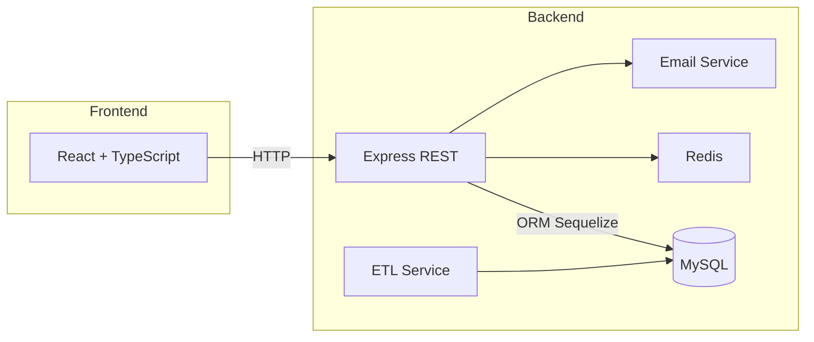

# Easy Traceability 2025

> Solution modulaire full‑stack pour la gestion de stocks, la traçabilité, l’entrepôt de données et les notifications, avec IoT et tableau de bord interactif.

---

## Table des matières

- [Présentation](#présentation)
- [Fonctionnalités](#fonctionnalités)
- [Architecture & Stack](#architecture--stack)
- [Prérequis](#prérequis)
- [Installation & Configuration](#installation--configuration)
- [Démarrage](#démarrage)
- [Docker](#docker)
- [Organisation du code](#organisation-du-code)
- [API & Endpoints](#api--endpoints)
- [Data Warehouse & ETL](#data-warehouse--etl)
- [Tests & Qualité](#tests--qualité)
- [Contribuer](#contribuer)
- [Roadmap](#roadmap)
- [Licence](#licence)
- [Contact](#contact)

---

## Présentation

**Easy Traceability 2025** centralise la gestion des stocks et la traçabilité produit.

- Back‑end Node.js/TypeScript avec Express, Sequelize & Redis
- Front‑end React/TypeScript avec DevExtreme
- Data Warehouse MySQL + ETL automatisé
- Notifications (email) et génération de codes-barres

## Fonctionnalités

1. **CRUD Inventaire** : articles, mouvements, commandes
2. **Génération Code128** pour étiquetage
3. **Authentification & rôles** : JWT, middleware `authorizeRole`, `hybridAuth`
4. **Cache & sessions** : Redis pour performance & sessions utilisateurs
5. **Upload images** : profils et seeder-img pour démonstration
6. **Dashboard** : statistiques, graphiques, filtres dynamiques
7. **Data Warehouse** : dimensions `dimProduct`, `dimUser`, `dimTime`, faits `factInventory`
8. **ETL** : logs, planificateur, transformation et chargement
9. **Notifications** : service `email.service.ts` pour alertes

## Architecture & Stack



- **Backend** : Node.js, Express, Sequelize, Redis, JWT, TypeScript
- **Frontend** : React, TypeScript, DevExtreme, Axios
- **CI/CD** : GitHub Actions (tests, lint, build)
- **Containerisation** : Docker Compose

## Prérequis

- **Node.js** v14+ & npm/Yarn
- **Docker** & **Docker Compose** (optionnel)
- **MySQL** (local ou conteneur)
- **Redis** (facultatif hors Docker)

## Installation & Configuration

1. **Cloner**

   ```bash
   git clone https://github.com/PierreOSSALE/Easy_Tracability_2025.git
   cd Easy_Tracability_2025
   ```

2. **Variables d’environnement**

   - Copier les exemples : `backend/.env.example → backend/.env`, `frontend/.env.example → frontend/.env`
   - Ajuster selon votre environnement

3. **Installer dépendances**

   ```bash
   cd backend && npm install
   cd ../frontend && npm install
   ```

## Démarrage

### Local sans Docker

```bash
# Backend en dev
cd backend && npm run dev
# Frontend en dev
cd ../frontend && npm start
```

- Front : [http://localhost:3000](http://localhost:3000)
- API : [http://localhost:4000/api](http://localhost:4000/api)

## Docker

Pour tout en un :

```bash
docker-compose up --build
```

Services :

- MySQL : 3306
- Redis : 6379
- API : 4000
- Front : 3000

## Organisation du code

```text
Easy_Tracability_2025/
├─ backend/
│  ├─ public/seeder-img/      # Images initiales
│  ├─ src/
│  │  ├─ config/               # DB & Redis
│  │  ├─ controllers/          # Routes handlers
│  │  ├─ dto/                  # Data transfer objects
│  │  ├─ interfaces/           # Types TypeScript
│  │  ├─ middlewares/          # Auth, error, file upload
│  │  ├─ models/               # Sequelize models & associations
│  │  ├─ routes/               # API routes
│  │  ├─ services/             # Business logic (auth, ETL, stats, email...)
│  │  ├─ utils/                # JWT, async catch, barcode generator, user utils
│  │  ├─ app.ts                # Initialisation Express
│  │  └─ server.ts             # Démarrage serveur
│  └─ package.json
├─ frontend/
│  ├─ public/
│  ├─ src/
│  │  ├─ api/                  # appels HTTP
│  │  ├─ assets/
│  │  ├─ components/           # UI, modals, sidebar, topbar
│  │  ├─ features/             # admin, manager, operator, auth
│  │  ├─ hooks/
│  │  ├─ routes/
│  │  ├─ services/             # gestion session, tokens
│  │  ├─ types/
│  │  └─ utils/
│  └─ package.json
└─ docker-compose.yml
```

## API & Endpoints

| Méthode | Endpoint                 | Description          |
| ------- | ------------------------ | -------------------- |
| POST    | `/api/auth/login`        | Authentification     |
| POST    | `/api/auth/register`     | Création utilisateur |
| GET     | `/api/inventory`         | Liste articles       |
| POST    | `/api/inventory`         | Ajouter article      |
| PUT     | `/api/inventory/:id`     | Mettre à jour        |
| DELETE  | `/api/inventory/:id`     | Supprimer article    |
| POST    | `/api/barcode/generate`  | Code128 image        |
| GET     | `/api/dashboard/summary` | Statistiques widget  |
| POST    | `/api/warehouse/etl`     | Lancer ETL           |

## Data Warehouse & ETL

- **Dimensions** : `dimProduct`, `dimUser`, `dimTime`
- **Faits** : `factInventory`
- **Flux** : `etl.service.ts`, `dataWarehouse.service.ts`
- **Logs** : `etlLog` pour audit

## Tests & Qualité

- **Backend** : Jest, Supertest (>=80% couverture)
- **Frontend** : React Testing Library, Jest
- **Lint** : ESLint, Prettier
- **CI** : GitHub Actions (pull requests)

## Contribuer

1. Fork & clone
2. Branche `feature/xxx`
3. Linter & tests
4. PR vers `develop`

Lire [`CONTRIBUTING.md`](.github/CONTRIBUTING.md)

## Roadmap

- Synchronisation offline
- Intégration scanners IoT réels
- Export CSV / PDF dashboards
- CI/CD déploiement cloud

## Licence

MIT © Pierre Ossale

## Contact

Pierre Ossale – [pierreossale.devweb@gmail.com](mailto:pierreossale.devweb@gmail.com)
GitHub: [PierreOSSALE](https://github.com/PierreOSSALE)

_Cap vers l’avenir de la traçabilité…_
